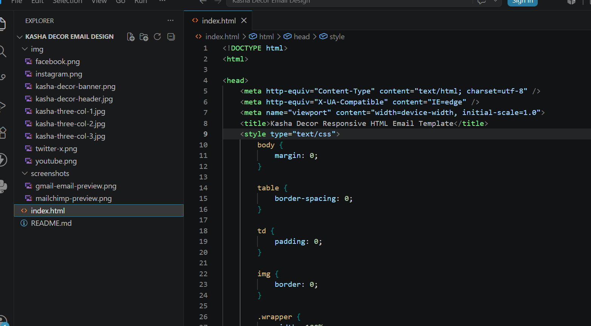
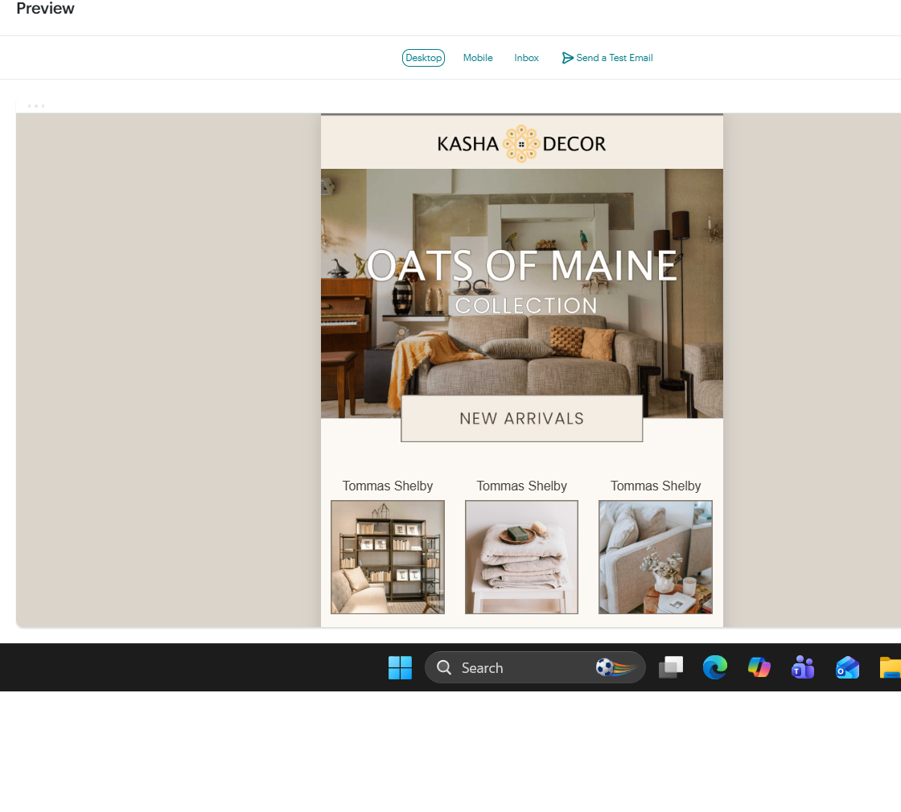
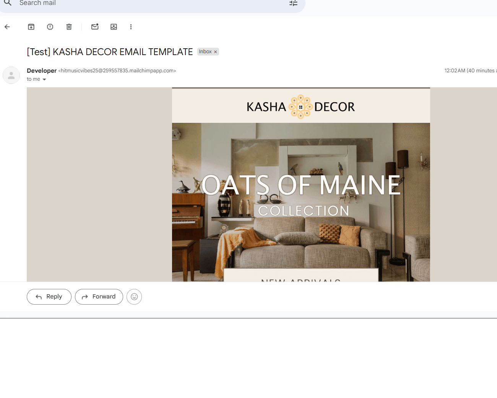

# 📧 Responsive HTML Email Templates

A collection of responsive HTML email templates built using HTML5, CSS3, and table-based layouts. Tested with Mailchimp for email client compatibility.

---

## 📸 Project Screenshots

### 💻 Source Code

---

### 📬 Mailchimp Preview

---

### 📧 Gmail Test Email

---

## ✨ Features

- Responsive HTML Email Layout
- Table-based Structure
- Mobile Friendly
- Mailchimp Compatible
- Cross Email Client Best Practices
- Tested by Sending Real Test Emails

---

## 🛠 Technologies

- HTML5
- CSS3
- Table-based Email Layouts
- Mailchimp

---

## 🎯 Purpose

This repository showcases my HTML email development skills and demonstrates the complete workflow of building, importing into Mailchimp, and testing responsive email templates.